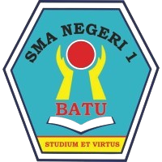
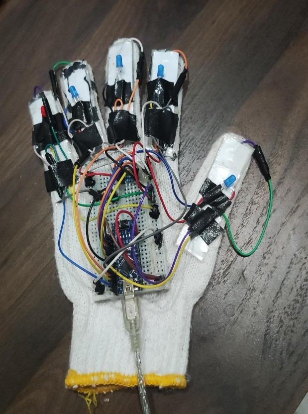
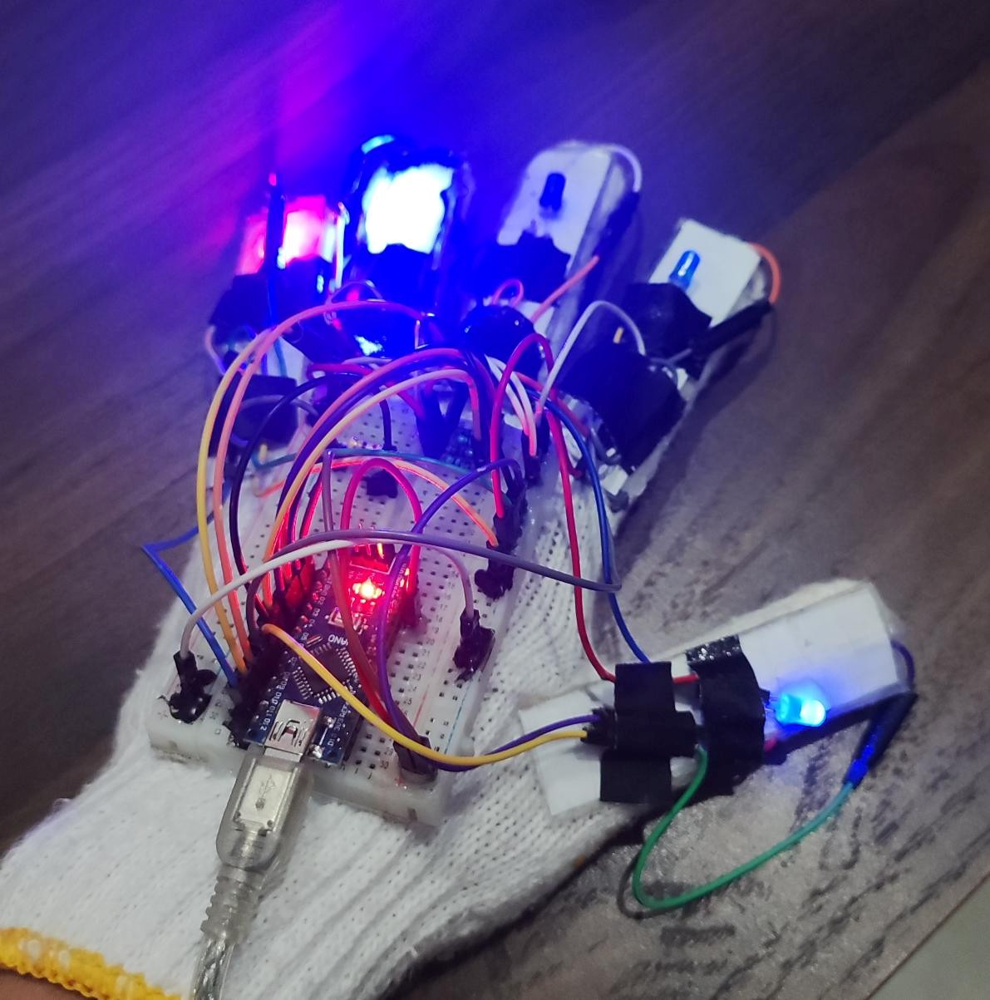
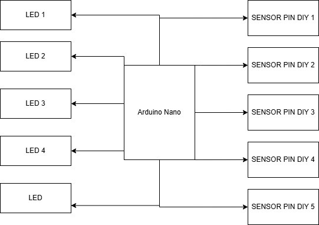
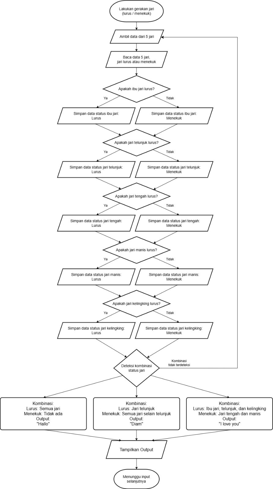

  
  <h1>🧤 GestureGlove</h1>
  
<b>Universal Appliance Controller & Sign Language Translator</b>

  
<i>SMA Negeri 1 Batu — Peminatan Informatika</i>

  
  
  

---

Perangkat keras interaktif berbasis sarung tangan (*wearable device*) yang memanfaatkan 5 sensor kontak jari DIY dan mikrokontroler Arduino Nano untuk menerjemahkan gestur tangan menjadi teks digital secara *real-time* melalui Serial Monitor. Ditujukan sebagai prototipe alat bantu komunikasi inklusif bagi penyandang disabilitas wicara dan rungu.

---

## 📌 Ringkasan Masalah & Solusi
* **Masalah:** Hambatan komunikasi yang sering dialami oleh penyandang disabilitas wicara karena tidak semua lawan bicara memahami bahasa isyarat.
* **Solusi:** **GestureGlove** mendeteksi status lekukan 5 jari tangan secara mandiri, memberikan umpan balik visual instan melalui LED per jari, dan menerjemahkan kombinasi pola gestur menjadi output teks informatif di layar monitor.

---

## ⚙️ Spesifikasi Perangkat & Pemetaan Pin

### Komponen Utama:
* **Mikrokontroler:** Arduino Nano (ATmega328P)
* **Sensor:** 5x Sensor Kontak Jari DIY (Konfigurasi `INPUT_PULLUP` Active-LOW)
* **Feedback Visual:** 5x LED Indikator Jari (Pin D2–D6) + Resistor 220Ω
* **Baud Rate Serial:** 9600 bps

### Tabel Koneksi Pin (Wiring Table):
| Jari Tangan | Pin Sensor (Input) | Pin LED Indikator (Output) | Status Terbuka | Status Ditekan/Ditekuk |
| :--- | :---: | :---: | :---: | :---: |
| **Jempol** | D7 | D2 | HIGH (LED Mati) | LOW (LED Nyala) |
| **Telunjuk** | D8 | D3 | HIGH (LED Mati) | LOW (LED Nyala) |
| **Jari Tengah** | D9 | D4 | HIGH (LED Mati) | LOW (LED Nyala) |
| **Jari Manis** | D10 | D5 | HIGH (LED Mati) | LOW (LED Nyala) |
| **Kelingking** | D11 | D6 | HIGH (LED Mati) | LOW (LED Nyala) |

---

## 🖐️ Logika Pemetaan Gestur (Matrix Rules)

| Output Teks | Jempol | Telunjuk | Tengah | Manis | Kelingking | Keterangan Gerakan |
| :--- | :---: | :---: | :---: | :---: | :---: | :--- |
| `TANGAN TERBUKA` | ❌ | ❌ | ❌ | ❌ | ❌ | Semua jari lurus / posisi diam |
| `TERIMA KASIH / TANGAN TERKEPAL` | ✅ | ✅ | ✅ | ✅ | ✅ | Semua jari ditekuk bersamaan |
| `JEMPOL / OK` | ✅ | ❌ | ❌ | ❌ | ❌ | Hanya jempol ditekuk |
| `DIAM / TUNJUK` | ❌ | ✅ | ❌ | ❌ | ❌ | Hanya telunjuk ditekuk |
| `TENGAH` | ❌ | ❌ | ✅ | ❌ | ❌ | Hanya jari tengah ditekuk |
| `PEACE ✌` | ❌ | ✅ | ✅ | ❌ | ❌ | Telunjuk dan jari tengah ditekuk |
| `MINUM` | ✅ | ✅ | ❌ | ❌ | ❌ | Jempol dan telunjuk ditekuk |
| `MAKAN` | ✅ | ✅ | ✅ | ❌ | ❌ | Jempol, telunjuk, dan tengah ditekuk |
| `HALO 👋` | ❌ | ✅ | ✅ | ✅ | ❌ | Telunjuk, tengah, dan manis ditekuk |
| `DIAM ✋` | ❌ | ✅ | ✅ | ✅ | ✅ | Empat jari selain jempol ditekuk |

*(Keterangan: ✅ = Jari Menekuk / Sinyal LOW, ❌ = Jari Terbuka / Sinyal HIGH)*

---

## 📷 Galeri Prototipe & Desain Sistem

### 1. Prototipe Perangkat Keras
| Tampak Fisik Prototipe | Pengujian Indikator LED Aktif |
| :---: | :---: |
|  |  |
| *Rangkaian fisik sarung tangan dengan sensor kontak 5 jari* | *Indikator visual LED menyala saat sensor terpicu* |

### 2. Skema & Alur Logika Sistem
| Skema Rangkaian Breadboard | Flowchart Pemrosesan Gestur |
| :---: | :---: |
|  |  |
| *Wiring diagram koneksi pin Arduino Nano ke sensor & LED* | *Diagram alur pembacaan sensor hingga klasifikasi teks* |

---

## 📄 Makalah & Laporan Riset
Dokumentasi lengkap mengenai latar belakang teori, estimasi biaya komponen, metodologi perakitan, dan analisis pengujian dapat dibaca langsung pada tautan berikut:
👉 [**Baca Dokumen Lengkap (PDF)**](docs/GestureGlove_Laporan_Akhir.pdf)

---

## 👥 Tim Pengembang (Peminatan Informatika)
* Muhammad Raffa Danendra
* Annisa Putri S.
* Catteleya Putri K.M.
* Checilia Shaca A.
* Fadli Ghifari
* Kilau Cincin M.
